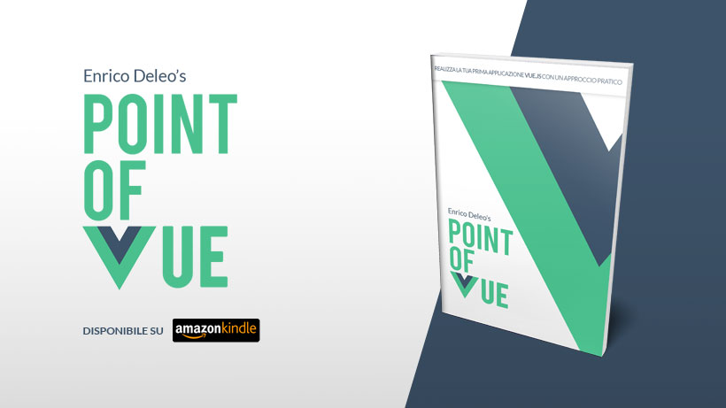

# Point of Vue

Il repository di esempi tratti dal libro [Point of VUE](https://amzn.to/30T952A), il primo libro interamente in italiano dedicato
all'introduzione e primi passi su Vue.js. [Disponibile adesso su Amazon Kindle](https://amzn.to/30T952A).

# Il libro

Vue è il progressive framework frontend con il maggior tasso di adozione degli ultimi anni. Questa caratteristica lo colloca tra le competenze più ricercate nelle figure frontend moderne da parte delle aziende.

Vue è stato progettato per essere un framework modulare, i cui componenti possono essere (o meno) adottati a discrezione dallo sviluppatore, rendendolo di fatto uno dei framework più flessibili dell'industria.

Questo testo vuole introdurre Vue.js allo sviluppatore già mediamente ferrato in ambito Javascript, che vuole andare al sodo ed ottenere una panoramica complessiva del framework ed esempi passo passo corredati di repository github con il risultato finale a riferimento.

[Compralo ora su Amazon](https://amzn.to/30T952A)

# Credits

* Author [Enrico Deleo](https://enricodeleo.com)
* Some image are from [Freepik.com](http://freepik.com)